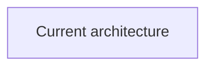
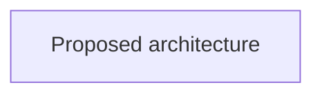

# ADR Skill

Use the MADR bare template as the only ADR format. Do not offer alternate ADR formats unless the target repo already has an incompatible ADR convention.

## ADR Shape

````markdown
---
status:
date:
decision-makers:
consulted:
informed:
---

# <!-- short title, representative of solved problem and found solution -->

## Context and Problem Statement

## Decision Drivers

* <!-- decision driver -->

## Considered Options

* <!-- option -->

## Decision Outcome

Chosen option: "", because

### Before and After

Use block diagrams because <!-- the material change concerns structure or boundaries -->

#### Before



#### After



### Consequences

* Good, because
* Bad, because

### Confirmation

## Pros and Cons of the Options

### <!-- title of option -->

* Good, because
* Neutral, because
* Bad, because

## More Information
````

Fill every section with real content or remove optional entries that do not apply. Never remove `Before and After` or either diagram from a new or substantively updated ADR. Keep ADRs concise, but preserve the rationale: decision drivers, outcome justification, and option pros/cons explain why the chosen option won.

### Diagram Contract

Every new or substantively updated ADR must include both `Before` and `After` diagrams in the `Decision Outcome` section. Status-only lifecycle updates, link corrections, and appended learnings do not require retrofitting an existing ADR.

If the repository has an incompatible ADR format that must be preserved, place the same required pair beside its equivalent decision or outcome section.

1. Ground `Before` in the current code, documentation, deployment, or operating flow. Do not infer a current state that has not been verified.
2. Ground `After` in the chosen option. Do not diagram rejected options as the proposed state.
3. Use Mermaid `sequenceDiagram` when the material change is interaction order, actors, requests, messages, protocols, or lifecycle.
4. Otherwise use Mermaid `flowchart` as a block diagram for components, boundaries, dependencies, deployment, data flow, ownership, or storage.
5. Use the same diagram family, direction, scope, abstraction level, and names in both views. Show only differences relevant to the decision.
6. Add one sentence before the pair explaining why the selected diagram type fits the change.
7. Never omit either diagram, replace one with prose, or write `N/A`. Simplify the views until a meaningful comparison fits.

## When to Write an ADR

Write an ADR when a decision:

- Changes how the system is built or operated.
- Is hard to reverse once code depends on it.
- Affects future contributors or agents.
- Has real alternatives worth recording.

Do not write an ADR for routine implementation details, bug fixes, style preferences, or decisions already captured in an existing ADR.

## Workflow

### 1. Scan the Repo

Before drafting:

1. Look for existing ADRs in `contributing/decisions/`, `docs/decisions/`, `adr/`, `docs/adr/`, `docs/adrs/`, or `decisions/`.
2. Preserve the repo's existing directory and filename convention.
3. Read related ADRs so the new decision does not conflict with accepted decisions.
4. Trace the current interaction flow or system structure that the `Before` diagram will represent.
5. Check related code/docs enough to understand the decision context.

### 2. Capture Intent

Ask questions one at a time. Stop when you can fill the bare template without inventing content.

Core questions:

1. What decision are we recording?
2. Why does it need to be decided now?
3. What drivers, constraints, or forces matter?
4. What options were considered?
5. Which option is chosen, and why does it best satisfy those drivers?
6. What exact current-state flow or structure should the `Before` diagram show?
7. What exact proposed flow or structure should the `After` diagram show?
8. Does the material change concern interactions and ordering, or components and boundaries?
9. What are the good, neutral, and bad consequences?
10. How will we confirm the decision is valid or complete?
11. Are there related ADRs, issues, PRs, or docs to link?

Before drafting, summarize the captured intent, selected diagram family, and diagram scope, then ask the human to confirm or correct it.

### 3. Draft the ADR

Use `assets/templates/adr-bare.md`.

Preferred:

```bash
node /path/to/adr-skill/scripts/new_adr.js --title "Choose database"
```

Then replace every placeholder with real content. Keep the ADR self-contained and focused on the decision.

Draft the paired diagrams only after confirming the current state and chosen outcome. Do not finalize an ADR while either diagram is generic, speculative, inconsistent with the prose, or syntactically invalid.

### 4. Review

Use `references/review-checklist.md` as a prompt list:

- Metadata follows repo convention.
- Context explains why the decision exists now.
- Decision drivers explain what mattered.
- Options are real alternatives.
- Outcome names the chosen option and gives the reason.
- `Before` accurately shows the verified current state.
- `After` accurately shows the chosen state.
- Both diagrams use the appropriate Mermaid family and a directly comparable scope.
- Consequences and option pros/cons include tradeoffs, not just positives.
- Confirmation says how the decision will be validated or considered complete.

Surface only meaningful gaps.

## Consulting Existing ADRs

Before implementing architecture-sensitive changes, read relevant ADRs:

1. Find the ADR directory and index.
2. Scan titles and read related ADRs fully.
3. Treat accepted decisions as constraints.
4. If the code conflicts with an accepted ADR, flag it before changing direction.

## Updating Existing ADRs

- **Substantive edit**: add or update the paired diagrams when changing the decision, architecture description, or intended state.
- **Accept/reject**: update the `status` field.
- **Deprecate**: set `status: deprecated` and explain replacement path in `More Information`.
- **Supersede**: prefer creating a new ADR and linking old and new records.
- **Add learnings**: append dated notes instead of rewriting history.

Use `scripts/set_adr_status.js` for status changes.

## Bootstrap

When introducing ADRs to a repo with no ADR directory:

```bash
node /path/to/adr-skill/scripts/bootstrap_adr.js --dir adr
```

This creates an index and a first bare-template ADR for adopting ADRs.

## Resources

- `assets/templates/adr-bare.md` - the only ADR template.
- `assets/templates/adr-readme.md` - ADR directory index scaffold.
- `references/examples.md` - filled-out bare ADR example.
- `references/adr-conventions.md` - directory, naming, status, and lifecycle conventions.
- `references/review-checklist.md` - bare-template review prompts.
- `scripts/new_adr.js` - creates a new ADR using the bare template.
- `scripts/bootstrap_adr.js` - creates an ADR directory, index, and first ADR.
- `scripts/set_adr_status.js` - updates ADR status in-place.
