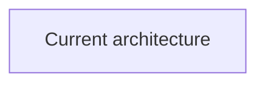
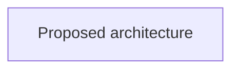

---
status:
date:
decision-makers:
consulted:
informed:
---

# <!-- short title, representative of solved problem and found solution -->

## Context and Problem Statement

## Decision Drivers

* <!-- decision driver -->

## Considered Options

* <!-- option -->

## Decision Outcome

Chosen option: "", because

### Before and After

<!--
Choose one Mermaid diagram family and use it for both views:
- sequenceDiagram for interactions, ordering, actors, messages, or protocols
- flowchart for components, boundaries, dependencies, data flow, or storage

Replace both placeholder diagrams. Keep their scope, direction, abstraction,
and names directly comparable.
-->

<!-- Explain in one sentence why this diagram family fits the change. -->

#### Before

#### After

### Consequences

* Good, because
* Bad, because

### Confirmation

## Pros and Cons of the Options

### <!-- title of option -->

* Good, because
* Neutral, because
* Bad, because

## More Information
