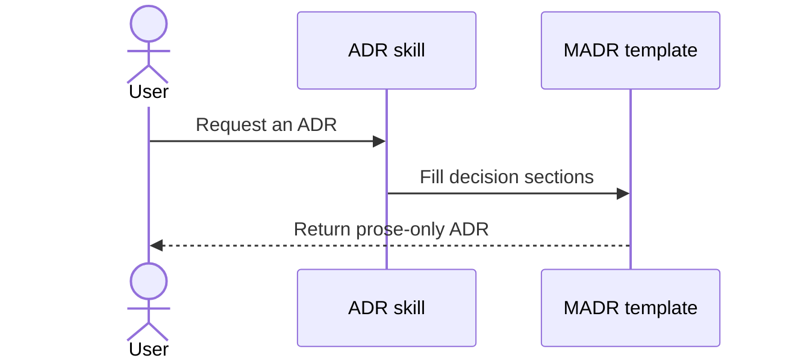
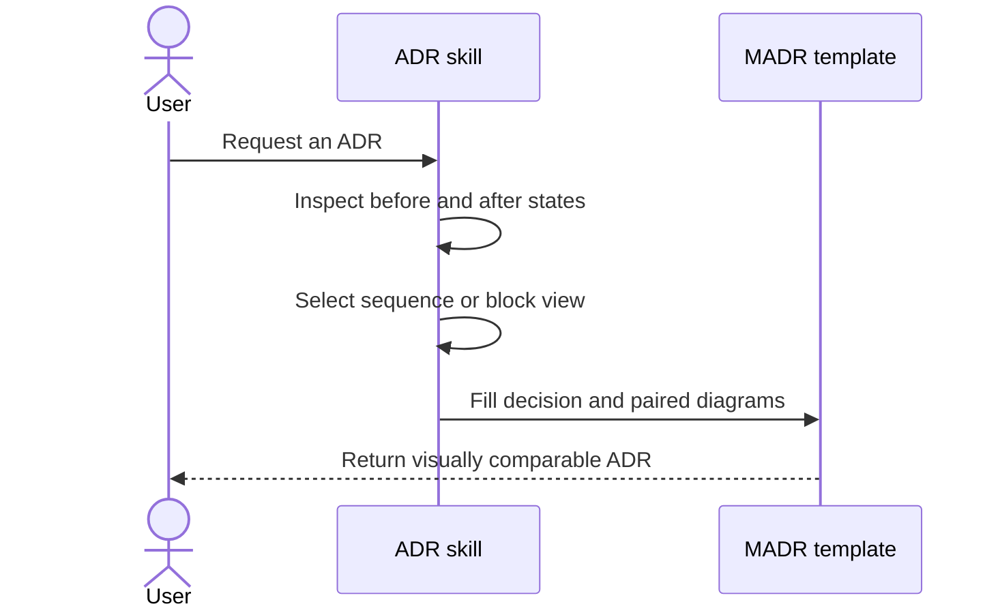

# Require before-and-after diagrams in ADRs

## Context and Problem Statement

The ADR skill records decisions and tradeoffs in prose, but it does not require a visual comparison of the architecture before and after a change. Readers must reconstruct interaction changes, component boundaries, and data flow from text alone.

How should new and substantively updated ADRs make architectural changes visually clear without replacing the MADR bare structure?

## Decision Drivers

* The architectural delta should be understandable at a glance.
* The diagram type should match the kind of change being described.
* Before and after views should use a comparable scope and level of detail.
* Diagrams should remain reviewable and version-controlled with the ADR.
* Existing ADRs should not require retroactive edits unless they are substantively updated.

## Considered Options

* Keep diagrams optional.
* Require diagrams only in the prose instructions.
* Require paired Mermaid diagrams across creation, examples, generation, and review.

## Decision Outcome

Chosen option: "Require paired Mermaid diagrams across creation, examples, generation, and review", because it makes the requirement difficult to miss and keeps diagrams portable, editable, and rendered alongside the ADR.

### Before and After

Use sequence diagrams because this decision changes the ADR creation and review workflow.

#### Before

#### After

### Consequences

* Good, because each affected ADR explicitly communicates the architectural delta.
* Good, because Mermaid diagrams remain diffable and render in Markdown.
* Good, because creation and review surfaces enforce the same requirement.
* Bad, because authors must spend additional time keeping diagrams accurate.
* Bad, because large changes may need simplification to keep both views comparable.

### Confirmation

The decision is confirmed when the skill instructions, bare template, generated bootstrap ADR, example, and review checklist all require matching before-and-after Mermaid diagrams and the skill passes validation.

## Pros and Cons of the Options

### Keep diagrams optional

* Good, because ADR authors do no additional work.
* Neutral, because authors can still add diagrams when they notice a need.
* Bad, because visual clarity remains inconsistent and unenforced.

### Require diagrams only in the prose instructions

* Good, because the change is small.
* Neutral, because an attentive agent may follow the requirement.
* Bad, because generated templates, examples, and reviews can still omit diagrams.

### Require paired Mermaid diagrams across creation, examples, generation, and review

* Good, because every ADR workflow surface reinforces the same contract.
* Good, because the paired layout makes the change directly comparable.
* Neutral, because the MADR bare sections remain intact with one added subsection.
* Bad, because multiple files must stay aligned when the contract changes.

## More Information

* Use `sequenceDiagram` for changes to interactions, ordering, or protocols.
* Use `flowchart` for changes to components, boundaries, dependencies, or data placement.
* Preserve existing ADRs unless they are substantively updated.
